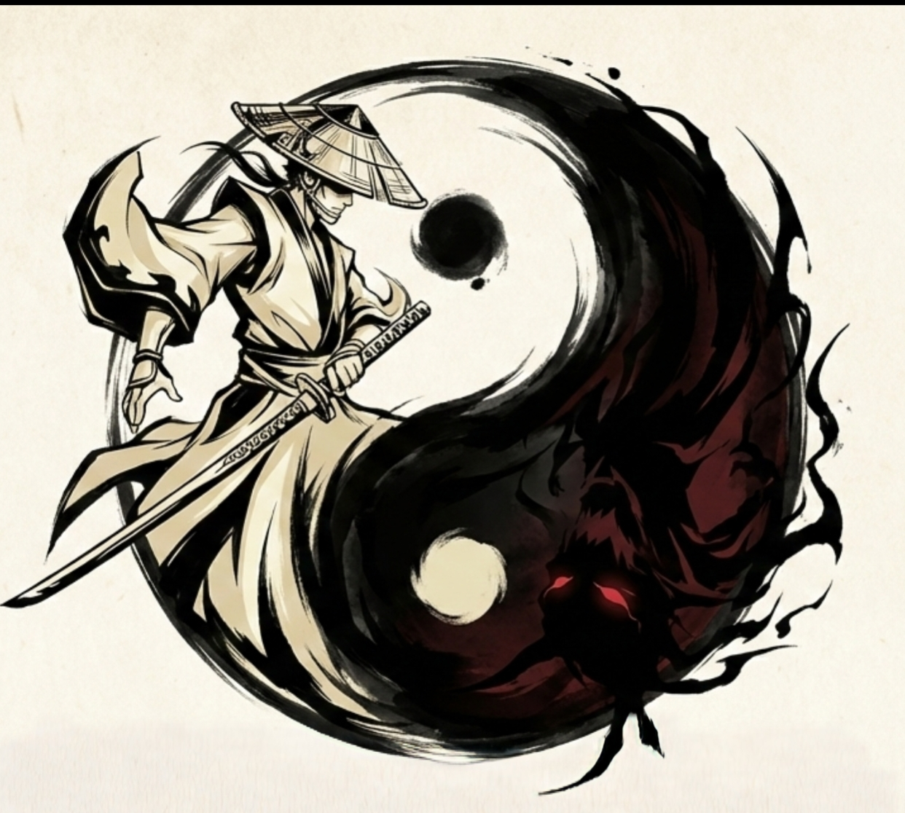

<p align="center">
  
</p>

<h1 align="center">MonoMask</h1>

<p align="center">
  <strong>🥈 2nd Runner-Up at Global Game Jam 2026 — IIIT Sricity</strong>
</p>

<p align="center">
  A duality-based 2D platformer where balance is survival.
</p>

---

## 🎮 About

**MonoMask** is a 2D platformer game built with Pygame that explores the theme of duality. Players control a mysterious samurai who can shift between two states — **Peace (White)** and **Tension (Black)** — to navigate through challenging levels. The world reacts to your state: platforms, enemies, and the environment behave differently based on which mask you wear.

*"The mask you wear becomes the world you walk."*

---

## 🏆 Achievements

| Event | Achievement | Location |
|-------|-------------|----------|
| **Global Game Jam 2026** | 🥈 2nd Runner-Up | IIIT Sricity |

---

## ✨ Features

- **Duality Mechanic** — Swap between White and Black states to interact with matching platforms
- **Samurai Combat** — Wield a katana with satisfying slash and ranged projectile attacks
- **Dynamic Audio** — Crossfading ambient soundtracks that shift with your state
- **Procedural Visuals** — Floating islands with sketchy, hand-drawn aesthetics
- **Multiple Levels** — Tutorial through challenging levels with unique layouts
- **Enemy AI** — Mirror Ronin enemies that guard key platforms
- **Boss Fights** — Face your Shadow Self in the final confrontation

---

## 🎯 How to Play

| Key | Action |
|-----|--------|
| `A` / `D` or `←` / `→` | Move left / right |
| `W` / `Space` / `↑` | Jump |
| **Left Click** | Ranged attack (Peace mode) / Melee slash (Tension mode) |
| `SHIFT` / `E` | Swap mask (toggle duality state) |
| `ESC` | Pause menu |

### The Duality System

- **White (Peace)** — Stand on white platforms, shoot ink projectiles
- **Black (Tension)** — Stand on black platforms, wield the katana
- **Neutral (Gray)** — Platforms accessible in both states

> ⚠️ Stepping on a platform that doesn't match your state means falling through!

---

## � Downloads

The latest playable version is available on our **GitHub Releases** page.

> [!WARNING]
> The current latest release (`v0.1.0`) is a standalone executable for **Windows only**.
> Mac and Linux users (or Windows users who prefer source) should follow the build instructions below.

[**👉 Download for Windows**](https://github.com/your-username/MonoMask/releases)

---

## �🛠️ Build it Yourself

### Prerequisites

- Python 3.13+
- [uv](https://github.com/astral-sh/uv) (recommended) or pip

### Quick Start

```bash
# Clone the repository
git clone https://github.com/your-username/MonoMask.git
cd MonoMask

# Using uv (recommended)
uv sync
uv run python main.py

# Or using pip
pip install pygame pillow
python main.py
```

---

## 📁 Project Structure

```
MonoMask/
├── main.py              # Game entry point
├── game/
│   ├── core.py          # Main game loop and mechanics
│   ├── sprites.py       # Player, platforms, projectiles
│   ├── enemy.py         # Enemy AI (MirrorRonin, ShadowSelf)
│   ├── menu.py          # Main menu and pause menu
│   ├── background.py    # Parallax background system
│   ├── utils.py         # Camera, effects, rendering
│   └── settings.py      # Game constants
├── assets/              # Audio and visual assets
└── user_settings.json   # Player preferences & save data
```

---

## 🔮 Roadmap

Development is ongoing! Planned features include:

- [ ] More levels with unique mechanics
- [ ] New enemy types
- [ ] Story cutscenes
- [ ] Steam/itch.io release

---

## 🙏 Credits

Created during **Global Game Jam 2026** at **IIIT Sricity**.

Built with ❤️ using [Pygame](https://www.pygame.org/).

---

## 📜 License

Copyright (c) 2026 MonoMask Team. All Rights Reserved.  
This project is proprietary. Source code is available for educational and viewing purposes only. See the [LICENSE](LICENSE) file for details.

---

<p align="center">
  <em>"In duality, we find balance. In balance, we find the path."</em>
</p>
